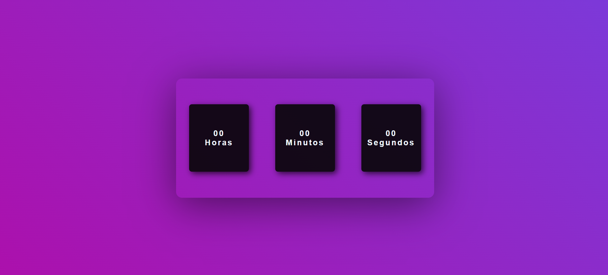

# Relógio Digital

Projeto de estilização de um relógio digital, ainda sem funcionalidade.

## Visualização

### Foto da tela

## Meu processo

### Construído com

- Visual Studio Code 
- HTML5
- CSS

### Aprendizado contínuo

Projeto feito com o intuito de exercitar HTML5 e CSS e me desafiar a achar a resolução dos problemas. Sinto que a prática traz muito mais aprendizado que a teoria, por isso é importante para mim estar constantemente me desafiando.

### Fontes úteis

- [W3 Schools](https://www.w3schools.com) - Essa fonte me ajuda muito a aprender as documentações do HTML e do CSS. Ensinando com exemplos práticos.

## Autora

- LinkedIn - [Vivian Freire](www.linkedin.com/in/vivian-gfreire)

